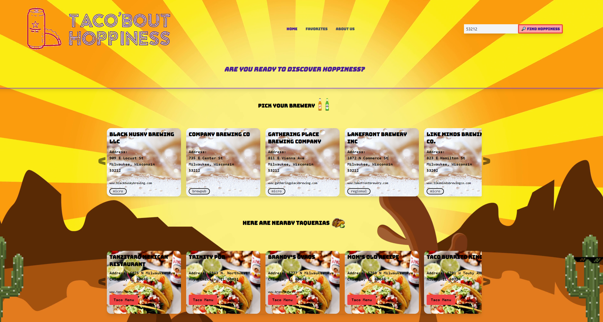

# Taco 'bout Hoppiness
## Repository to for finding hoppiness

Welcome to Taco'bout Hoppiness. In this project, the team developed an application that helps you locate breweries and Taco restauarnts in your area of choice.
The team used three different APIs(Open Weather, Open brewey DB, and Documenu) to convert the user's Zipcode to Latitude/Longitude coordinates, then retreive nearby breweries and Mexican restaurants.
Each of the returned results displays the business name, address, website(if available) in addition to brewery categories and restaurant menus.

## Table of Contents

- [Installation]
- [Usage]
- [Credits]
- [Created By]
- [License]

## Installation

No installation is required to use or see this site. Follow the link below to see our work in action.

## Usage
This repository can only be viewed at the following link: [Taco'bout Hoppiness](https://p1t2-better-booze-bureau.github.io/Taco-bout-Hoppiness/)

It should look like the following:



The site currently does the following:

```
Enter a zip code to pull up nearby breweries.

From there, scroll through the displayed brewery cards to select your preferred brewery, and pull up taco places near there.

The taco cards can be scrolled through, and you can pull up the restaurant's taco menu (Work-in-progress).

The modal allows you to save the pairing of brewery and taco restaurant to your favorites.

You can navigate to your favorites tab to pull up your list of favorite pairings with information, and delete whatever pairing as needed.

The site also has an about me section for all members of the Better Booze Bureau.
```

## Credits
We would like to credit the following for helping us :

```
[For generating our favicon] (https://www.favicon.cc/)
[For background patterns] (https://heropatterns.com/)

The tailwind and flowbite documentation sites for helping us style our site.

The Documenu API: https://documenu.com/
The Open Weather GeoCoding API: https://openweathermap.org/api/geocoding-api
The Open Brewery API: https://www.openbrewerydb.org/

Artwork came from the following:
- Tumbleweed: https://images.uncyc.org/commons/8/83/Tumbleweed01.gif

- 8-Bit Cactus: https://th.bing.com/th/id/R.cd7ce05331641e8bbdc80b65cff311f8?rik=TWTZBPgoteNIpA&riu=http%3a%2f%2fwww.kauergames.com%2fwp-content%2fuploads%2f2017%2f01%2fpixel-art-cactus-step-6.png&ehk=GY2Ynu93GX%2byYMnxT3Dx36yimv4FILc5F2QietZ4mZc%3d&risl=&pid=ImgRaw&r=0

- 8-Bit Tacos: https://dejpknyizje2n.cloudfront.net/marketplace/products/8-bit-pixel-art-taco-sticker-1590637399.638478.png

- 8-Bit Limes: https://th.bing.com/th/id/R.9aebb6c4495bb13e17c6845f31165a10?rik=KRwTLHANObq5ZQ&riu=http%3a%2f%2fimages.cdn2.stockunlimited.net%2fclipart%2flime-pixel-art_2021164.jpg&ehk=R%2fLUmKvCL9aEPwWVIMWIDL4C%2fMVWkJlAsh3%2bTA7i5A0%3d&risl=&pid=ImgRaw&r=0

- 8-Bit Beer: https://cdn.dribbble.com/users/10441/screenshots/2416428/beers.png | https://dribbble.com/shots/2416428-pixel-beers-from-brazil/attachments/9289635?mode=media

- 8-Bit Desert: https://mir-s3-cdn-cf.behance.net/project_modules/1400/8fa7126910307.5a212a61b74ce.jpg

- Yellow Desert Landscape: https://www.dreamstime.com/desert-landscape-cactuses-sunset-background-illustration-image116231450

- Logo: https://looka.com/
```

We would also like to credit our teacher, teaching assistants, and current classmates at Northwestern bootcamp for providing us the resources to practice and create the website you see here. 

## Created By
Better Booze Bureau, a subdivision of MGJY

## License

MIT License

Copyright (c) [2022] [Better Booze Bros, a subdivision of MGJY]

Permission is hereby granted, free of charge, to any person obtaining a copy of this software and associated documentation files (the "Software"), to deal in the Software without restriction, including without limitation the rights to use, copy, modify, merge, publish, distribute, sublicense, and/or sell copies of the Software, and to permit persons to whom the Software is furnished to do so, subject to the following conditions:

The above copyright notice and this permission notice shall be included in all copies or substantial portions of the Software.

THE SOFTWARE IS PROVIDED "AS IS", WITHOUT WARRANTY OF ANY KIND, EXPRESS OR IMPLIED, INCLUDING BUT NOT LIMITED TO THE WARRANTIES OF MERCHANTABILITY, FITNESS FOR A PARTICULAR PURPOSE AND NONINFRINGEMENT. IN NO EVENT SHALL THE AUTHORS OR COPYRIGHT HOLDERS BE LIABLE FOR ANY CLAIM, DAMAGES OR OTHER LIABILITY, WHETHER IN AN ACTION OF CONTRACT, TORT OR OTHERWISE, ARISING FROM, OUT OF OR IN CONNECTION WITH THE SOFTWARE OR THE USE OR OTHER DEALINGS IN THE SOFTWARE.
